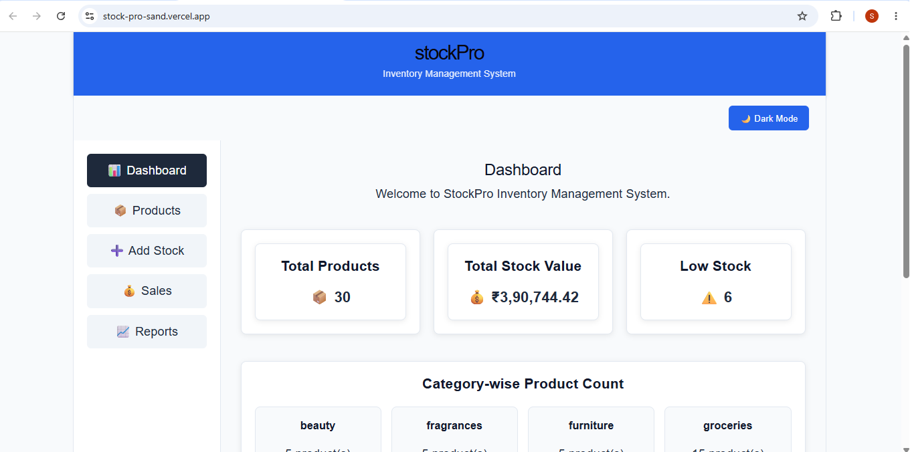
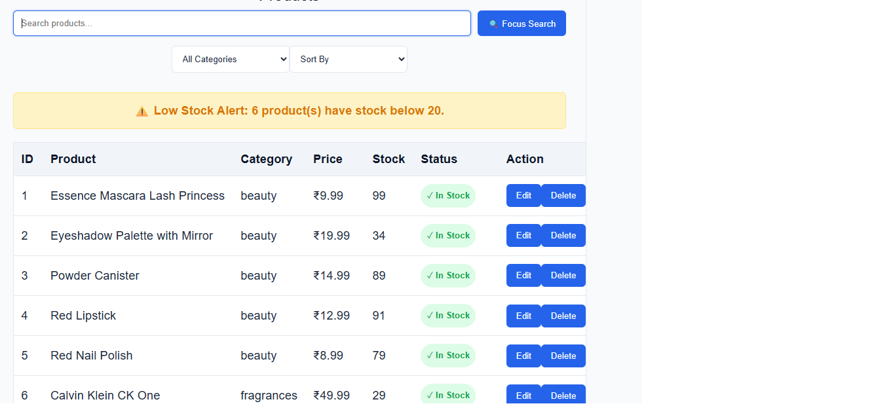
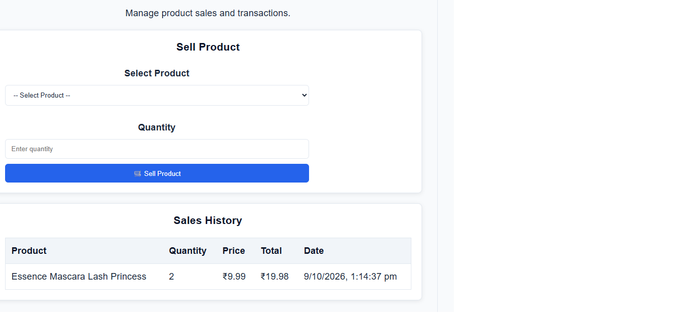
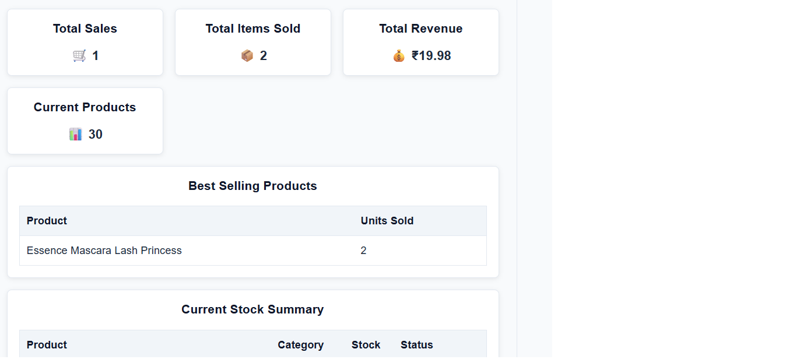

# StockPro – Inventory Management System

StockPro is a React-based inventory management application designed to help users manage products, monitor stock levels, record sales, and view inventory reports through a simple dashboard.

## Live Demo

* **Live Website:** https://stock-pro-sand.vercel.app/
* **GitHub Repository:** https://github.com/sarusaravana36-hash/StockPro

## Features

* Dashboard with inventory statistics
* Product listing and product management
* Add stock and update inventory
* Search, filtering, sorting, and pagination
* Sales management
* Reports and inventory summaries
* Reusable React components
* Responsive user interface

## Technologies Used

* HTML5
* CSS3
* JavaScript
* React
* Vite
* npm
* Git and GitHub
* Vercel for deployment

## Run the Project Locally

### Prerequisites

Install Node.js and npm.

### Installation

1. Clone the repository:

   ```bash
   git clone https://github.com/sarusaravana36-hash/StockPro.git
   ```

2. Open the project directory:

   ```bash
   cd StockPro
   ```

3. Install dependencies:

   ```bash
   npm install
   ```

4. Start the development server:

   ```bash
   npm run dev
   ```

5. Open the local URL displayed in your terminal.

### Production Build

To build the application for production, run:

```bash
npm run build
```

The production files will be generated in the `dist` directory.

## Deployment

The project is deployed on Vercel and connected to the GitHub repository. New commits pushed to the `main` branch can trigger a new deployment.

## Project Purpose

This project was developed as a capstone project to practise React development, component-based design, inventory management workflows, and deployment.

## Author

**Saravana S**

* GitHub: https://github.com/sarusaravana36-hash

## Screenshots

### Dashboard


### Products


### Sales


### Reports
